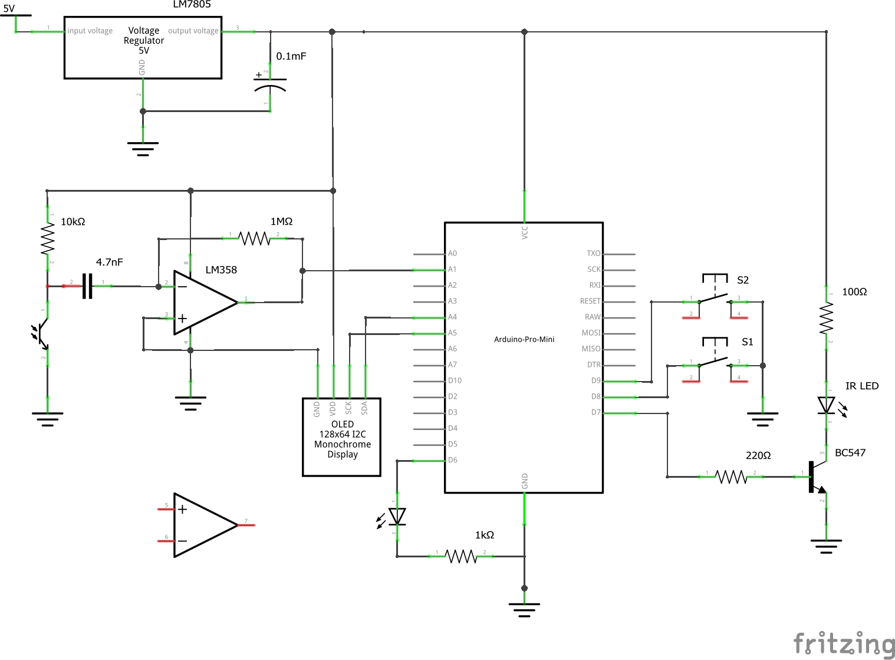

# IR Tachometer

# Required libraries

To compile QmuBeacon you will need some external libraries that are not part of this repository. Those are:

* [Adafruit SSD1306](https://github.com/adafruit/Adafruit_SSD1306)

# Hardware

* [Arduino Pro Mini](http://bit.ly/2DjkkHZ)
* [SSD1306 128x64 OLED I2C display](http://bit.ly/2PTBaAX)
* 5V voltage regulator
* 100uF capacitor
* 4.7nF capacitor
* [2 tactile buttons](http://bit.ly/2Kzawy3)
* [IR LED](http://bit.ly/2nphnQq)
* [IR sensitive phototransistor(http://bit.ly/2oT3WJ8)
* 100Ohm resistor
* 220Ohm resistor
* BC547 transistor
* any color 3mm LED
* 1kOhm resistor
* 1MOhm resitor
* LM358 dual op-amp
* 10kOhm resistor

